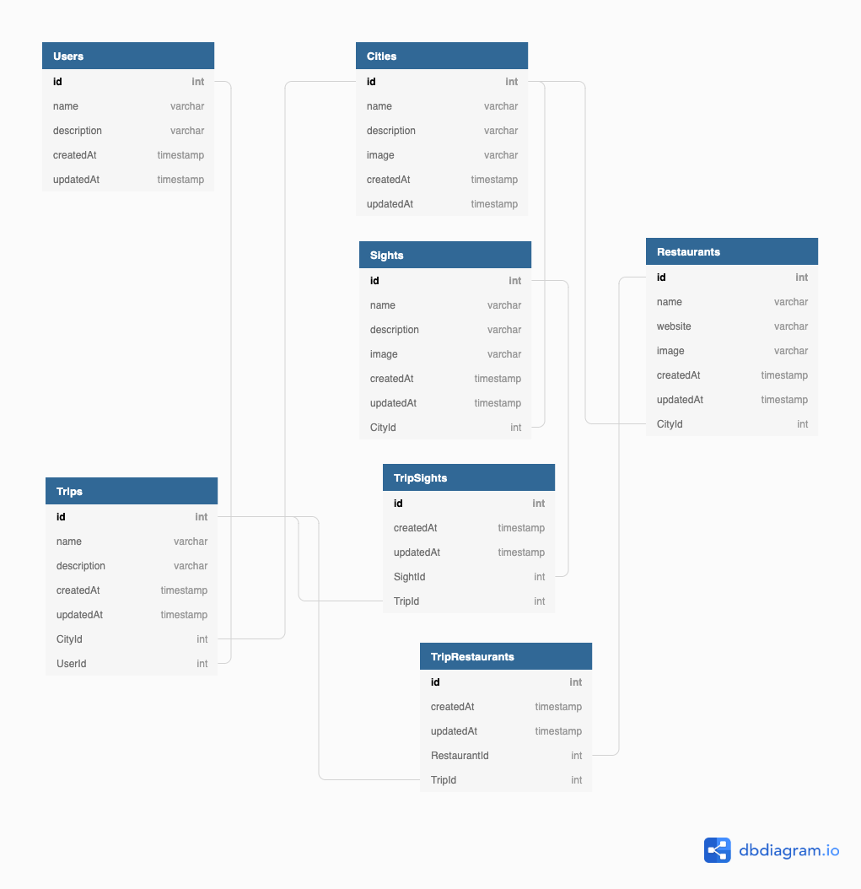
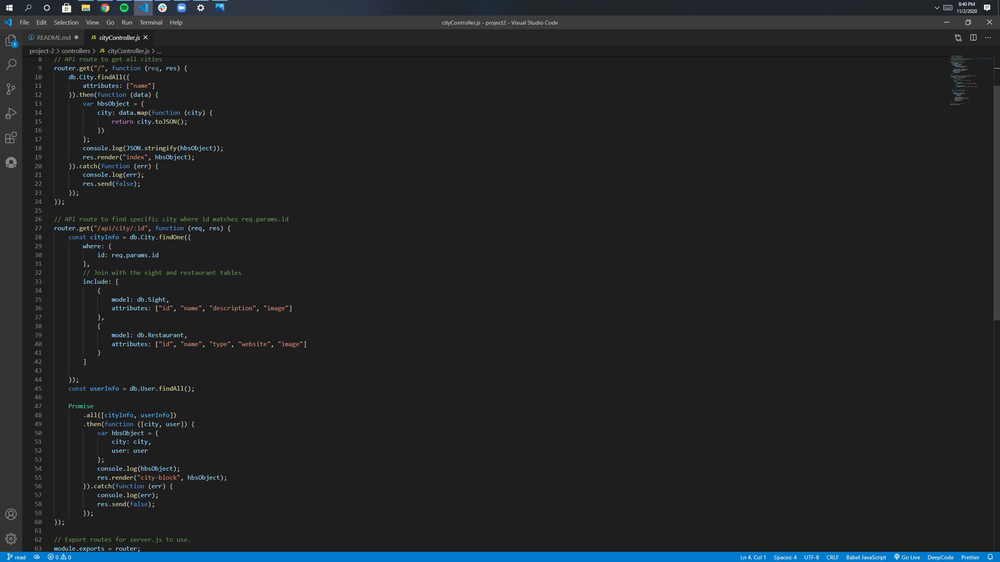
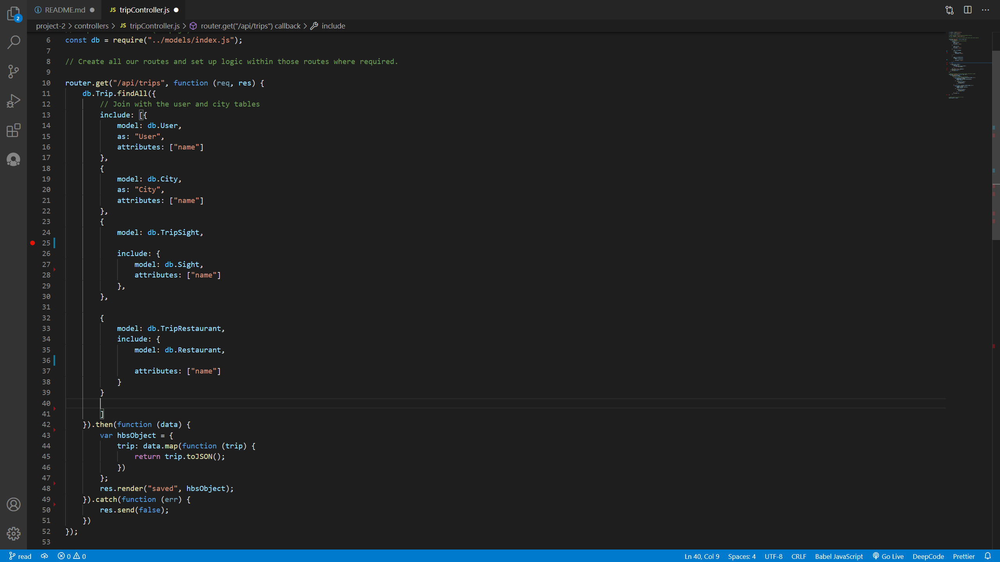
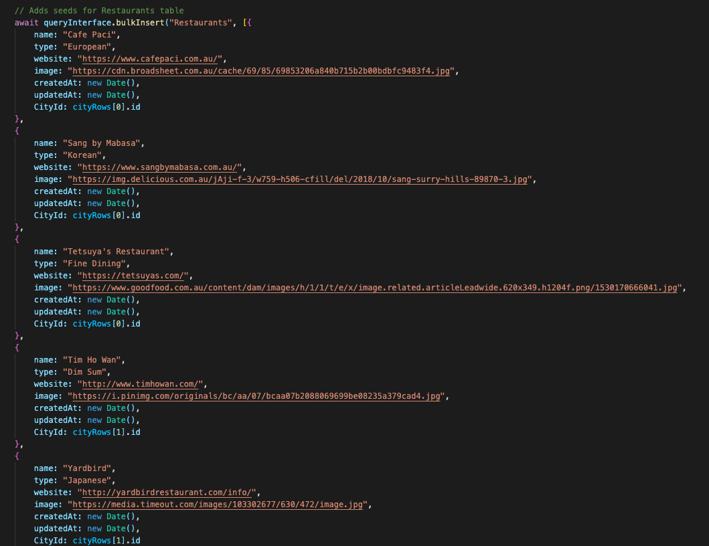

<!-- 
 -->

# Xplore

## Description
Xplore was created to eliminate multiple browser tabs, excel spreadsheets, or handwritten notes for trip planning. With Xplore you can find all the information you need in one location to plan your trip. As an Xplorer you will be able to easily select from one of our cities which will populate you with the top restaurants and sights in the area and a place plan your trip. Xplore wants our Xplorers to spend less time searching and more time exploring.

## Table of Contents
* [Features](#features)
* [Built With](#Built_With)
* [Deployed Link](#Deployed_Link)
* [Code](#Code)
* [Credits](#Credits)
* [Authors](#Authors)
* [License](#License)

## Features
* MySQL database with one to many, many to one, and many to many relationships
* Materialize is a modern responsive front-end framework based on Material Design
* Handlebars is used to dynamically create HTML to render the page view
    * Each time the page is refreshed by a request or the user, HTML is dynamically rendered based on a response from the database/server
* Model View Controller(MVC) design pattern is used to organize code 
    * Model - contains a model for the user, city, index, restaurnts, sights, and trips ORM
    * View - contains HTML files that utlize Handlebars
    * Controller - contains routes for GET and POST requests to get data from the database, add data to the database, and update the database

## Built With
* [Handlebars](https://handlebarsjs.com/) - a semantic templating framework for JavaScript and HTML
* [Materialize](https://materializecss.com/) - a modern front-end framework for responsiveness
* [Animate CSS](https://animate.style/) - a library of ready-to-use animations for CSS
* [Express](https://expressjs.com/) - a back-end web application framework for Node.js
* [MySQL](https://www.mysql.com/) - a relational database management system
* [Sequelize](https://sequelize.org/) - a promise-based Node.js ORM for MySQL and other databases
* [Sequelize CLI](https://www.npmjs.com/package/sequelize-cli) - Node.js package for interfacing with Sequelie from the command line
* [Node.js](https://nodejs.org/en/) - a JavaScript runtime environment that allows JavaScript to be run in command line
* [JavaScript](https://developer.mozilla.org/en-US/docs/Web/JavaScript) - code that creates the logic and structure of the program
* [Heroku](https://heroku.com) - a cloud platform for deploying web applications
* [JawsDB](https://www.jawsdb.com/) - database service for deploying in Heroku
* [Git](https://git-scm.com/) - version control system to track changes in source code
* [GitHub](https://github.com/) - hosts repository and deploys page on GitHub

## Deployed Link
[Xplore](https://shrieking-nightmare-37185.herokuapp.com/) - Xplore

## Database
* The database is comprised of seven models with one-to-many, many-to-one, and many-to-many relationships.

## Code
* City Controller API routes. One GET route for querying all cities from the database. Another GET route for querying specific cities and their respective restaurants and sights.

* Trip Controller API route. GET route for querying all trips from the database and retrieving associated user, city, restaurants, and sights.

* Trip Controller API route. GET route with two for loops to add sights and restaurants to a trip

* Seeder file to populate the database with information for users, cities, sights, restaurants, and trips

## Credits
* [Font Awesome](https://fontawesome.com/icons/) - logos

## Authors
* Rebecca Eng
* [GitHub](https://github.com/engrebecca)
* [LinkedIn](https://www.linkedin.com/in/engrebecca/)
* Kelly Stone
* [Github](https://github.com/kellystone4)
* [LinkedIn](https://www.linkedin.com/in/kelly-a-stone/)
* Andrew Kosel
* [Github](https://github.com/andrewkosel)
* [LinkedIn](https://www.linkedin.com/in/andrew-kosel/)

## License

MIT License
Copyright (c) [2020] [Rebecca Eng, Kelly Stone, Andrew Kosel]
Permission is hereby granted, free of charge, to any person obtaining a copy
of this software and associated documentation files (the "Software"), to deal
in the Software without restriction, including without limitation the rights
to use, copy, modify, merge, publish, distribute, sublicense, and/or sell
copies of the Software, and to permit persons to whom the Software is
furnished to do so, subject to the following conditions:
The above copyright notice and this permission notice shall be included in all
copies or substantial portions of the Software.
THE SOFTWARE IS PROVIDED "AS IS", WITHOUT WARRANTY OF ANY KIND, EXPRESS OR
IMPLIED, INCLUDING BUT NOT LIMITED TO THE WARRANTIES OF MERCHANTABILITY,
FITNESS FOR A PARTICULAR PURPOSE AND NONINFRINGEMENT. IN NO EVENT SHALL THE
AUTHORS OR COPYRIGHT HOLDERS BE LIABLE FOR ANY CLAIM, DAMAGES OR OTHER
LIABILITY, WHETHER IN AN ACTION OF CONTRACT, TORT OR OTHERWISE, ARISING FROM,
OUT OF OR IN CONNECTION WITH THE SOFTWARE OR THE USE OR OTHER DEALINGS IN THE
SOFTWARE.